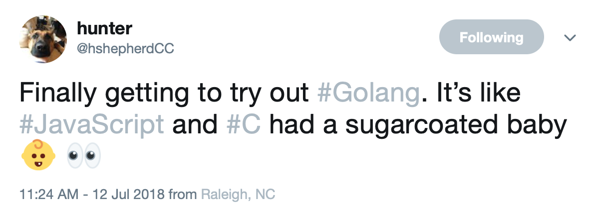
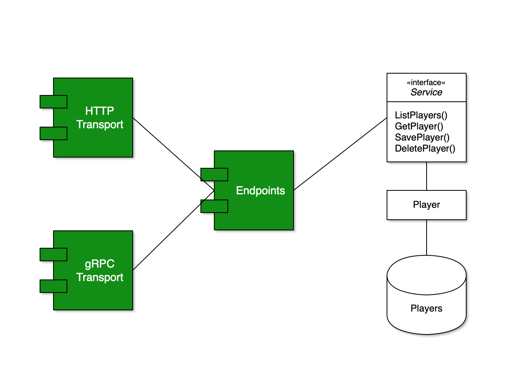

footer: https://github.com/hoop33/roster
slidenumbers: true

# Building Microservices in Go Using Go kit

## Rob Warner

* GitHub: @hoop33
* Twitter: @hoop33
* Email: hoop33@gmail.com
* Blog: https://grailbox.com
* Repo: https://github.com/hoop33/roster


---

## Agenda

* Introduce Go kit
* Build a CLI CRUD app
* Add HTTP
* Add gRPC
* Build a Node client

---



https://twitter.com/hshepherdCC/status/1017429517374287872

---

## Go kit

> "A toolkit for microservices"

* Created by Peter Bourgon (https://peter.bourgon.org/about/)
* Collection of tools
* Separation of concerns
* https://gokit.io

---

## Roster



---

## Step 0: The Data

```sql
CREATE TABLE IF NOT EXISTS players (
  id SERIAL PRIMARY KEY,
  name TEXT,
  number TEXT,
  position TEXT,
  height TEXT,
  weight TEXT,
  age TEXT,
  experience INTEGER,
  college TEXT
)
```

https://www.jaguars.com/team/players-roster/


---

## Step 1: The Model

```go
type Player struct {
	ID         int    `db:"id" json:"id"`
	Name       string `db:"name" json:"name"`
	Number     string `db:"number" json:"number"`
	Position   string `db:"position" json:"position"`
	Height     string `db:"height" json:"height"`
	Weight     string `db:"weight" json:"weight"`
	Age        string `db:"age" json:"age"`
	Experience int    `db:"experience" json:"experience"`
	College    string `db:"college" json:"college"`
}
```

---

## Step 1 (cont): Data Access

```go
func ListPlayers(db *sqlx.DB, position string) ([]Player, error) {
	var players []Player
	var err error
	if position == "" {
		err = db.Select(&players, 
		  "SELECT * FROM players ORDER BY number ASC")
	} else {
		err = db.Select(&players, 
		  "SELECT * FROM players WHERE position = $1 ORDER BY number ASC", position)
	}
	if err != nil {
		return nil, err
	}
	if len(players) == 0 {
		return nil, sql.ErrNoRows
	}
	return players, nil
}
```

---

## Step 1 (cont): The Service

```go
type Service interface {
	ListPlayers(context.Context, string) ([]models.Player, error)
	GetPlayer(context.Context, int) (*models.Player, error)
	SavePlayer(context.Context, *models.Player) (*models.Player, bool, error)
	DeletePlayer(context.Context, int) error
}
```

---

## Step 1 (cont): Data Service Implementation

```go
type service struct {
	db *sqlx.DB
}

func (p *service) ListPlayers(_ context.Context, position string) 
  ([]models.Player, error) {
	players, err := models.ListPlayers(p.db, position)
	if err == sql.ErrNoRows {
		return nil, errNotFound
	}
	return players, err
}
```

:football:

---

## Step 2: Add Logger

```go
type loggingService struct {
	logger log.Logger
	next   Service
}

func (l *loggingService) ListPlayers(ctx context.Context, position string) 
  (players []models.Player, err error) {
	defer func(begin time.Time) {
		l.logger.Log("msg", "listing players", 
		             "pos", position, 
		             "num", len(players), 
		             "err", err, "took", 
		             time.Since(begin))
	}(time.Now())

	return l.next.ListPlayers(ctx, position)
}
```

---

## Step 2 (cont): Chain Services

```go
func createPlayersService(db *sqlx.DB, logger log.Logger) players.Service {
	ps := players.NewService(db)
	ps = players.NewLoggingService(log.With(logger, "tag", "players"), ps)
	return ps
}
```

:football:

--- 

## Step 3: Add Endpoints

```go
type Endpoint func(ctx context.Context, 
  request interface{}) (response interface{}, err error)
```

---

## Step 3 (cont): Endpoints

```go
type Endpoints struct {
	listPlayersEndpoint  endpoint.Endpoint
	getPlayerEndpoint    endpoint.Endpoint
	savePlayerEndpoint   endpoint.Endpoint
	deletePlayerEndpoint endpoint.Endpoint
}

func NewEndpoints(s Service) *Endpoints {
	return &Endpoints{
		listPlayersEndpoint:  makeListPlayersEndpoint(s),
		getPlayerEndpoint:    makeGetPlayerEndpoint(s),
		savePlayerEndpoint:   makeSavePlayerEndpoint(s),
		deletePlayerEndpoint: makeDeletePlayerEndpoint(s),
	}
}
```

---

## Step 3 (cont): Request/Response

```go
type listPlayersRequest struct {
	Position string `json:"position,omitempty"`
}

type listPlayersResponse struct {
	Players []models.Player `json:"players,omitempty"`
	Err     string          `json:"error,omitempty"`
}
```

---

## Step 3 (cont): An Endpoint

```go
func makeListPlayersEndpoint(s Service) endpoint.Endpoint {
	return func(ctx context.Context, request interface{}) 
	  (interface{}, error) {
		req := request.(listPlayersRequest)
		players, err := s.ListPlayers(ctx, req.Position)
		if err != nil {
			return listPlayersResponse{
				Err: err.Error(),
			}, nil
		}
		return listPlayersResponse{
			Players: players,
		}, nil
	}
}
```

---

## Step 4: Add HTTP Transport

```go
func NewHTTPTransport(ep *Endpoints, logger log.Logger) http.Handler {
	opts := []kithttp.ServerOption{
		kithttp.ServerErrorLogger(log.With(logger, "tag", "http")),
		kithttp.ServerErrorEncoder(encodeHTTPError),
	}

	listPlayersHandler := kithttp.NewServer(
		ep.listPlayersEndpoint,
		decodeHTTPListPlayersRequest,
		encodeHTTPListPlayersResponse,
		opts...,
	)
  ...
}
```

---

## Step 4 (cont): HTTP Request/Response

```go
func decodeHTTPListPlayersRequest(_ context.Context, r *http.Request) 
  (interface{}, error) {
	return listPlayersRequest{
		Position: r.URL.Query().Get("position"),
	}, nil
}

func encodeHTTPListPlayersResponse(ctx context.Context, 
  w http.ResponseWriter, response interface{}) error {
	lpr := response.(listPlayersResponse)
	if lpr.Err == "" {
		return encodeHTTPResponse(ctx, http.StatusOK, w, response)
	}
	encodeHTTPError(ctx, getHTTPError(lpr.Err), w)
	return nil
}
```

---

## Step 4 (cont): Handle Routes

```go
	r := mux.NewRouter()
	r.Handle("/v1/players", listPlayersHandler).Methods("GET")
	r.Handle("/v1/players/{id}", getPlayerHandler).Methods("GET")
	r.Handle("/v1/players", createPlayerHandler).Methods("POST")
	r.Handle("/v1/players/{id}", updatePlayerHandler).Methods("PUT")
	r.Handle("/v1/players/{id}", deletePlayerHandler).Methods("DELETE")
```

:football:

---

## Step 5: Protocol Buffers

* https://developers.google.com/protocol-buffers/
* Install `protoc` compiler
* Install language-specific plugin
* Create `.proto` file(s)

---

## Step 5 (cont): Protocol Buffer Service

```c
service Players {
  rpc ListPlayers(ListPlayersRequest) returns (ListPlayersResponse) {}
  rpc GetPlayer(GetPlayerRequest) returns (GetPlayerResponse) {}
  rpc SavePlayer(SavePlayerRequest) returns (SavePlayerResponse) {}
  rpc DeletePlayer(DeletePlayerRequest) returns (DeletePlayerResponse) {}
}
```

---

## Step 5 (cont): Protocol Buffer Player

```go
message Player {
  int32 id = 1;
  string name = 2;
  string number = 3;
  string position = 4;
  string height = 5;
  string weight = 6;
  string age = 7;
  int32 experience = 8;
  string college = 9;
}
```

---

## Step 5 (cont): Protocol Buffer Request/Response

```c
message ListPlayersRequest {
  string position = 1;
}

message ListPlayersResponse {
  repeated Player players = 1;
  string err = 2;
}
```

---

## Step 6: Add gRPC Transport

* https://grpc.io
* https://github.com/ktr0731/evans

---

## Step 6 (cont): Add gRPC Handlers

```go
type grpcTransport struct {
	listPlayers  grpc.Handler
	getPlayer    grpc.Handler
	savePlayer   grpc.Handler
	deletePlayer grpc.Handler
}
```

---

## Step 6 (cont): Add gRPC Transport

```go
func NewGRPCTransport(ep *Endpoints, logger log.Logger) 
  pb.PlayersServer {
	opts := []grpc.ServerOption{
		grpc.ServerErrorLogger(log.With(logger, "tag", "grpc")),
	}

	return &grpcTransport{
		listPlayers: grpc.NewServer(
			ep.listPlayersEndpoint,
			decodeGRPCListPlayersRequest,
			encodeGRPCListPlayersResponse,
			opts...,
		),
		...
	}
}
```

---

## Step 6 (cont): gRPC Request

```go
func decodeGRPCListPlayersRequest(_ context.Context, r interface{}) 
  (interface{}, error) {
	req := r.(*pb.ListPlayersRequest)
	return listPlayersRequest{
		Position: req.Position,
	}, nil
}
```

---

## Step 6 (cont): gRPC Response

```go
func encodeGRPCListPlayersResponse(_ context.Context, r interface{}) 
  (interface{}, error) {
	resp := r.(listPlayersResponse)

	players := make([]*pb.Player, len(resp.Players))
	for i, p := range resp.Players {
		player := modelsPlayerToProtoPlayer(p)
		players[i] = &player
	}

	return &pb.ListPlayersResponse{
		Players: players,
		Err:     resp.Err,
	}, nil
}
```

---

## Step 6 (cont): gRPC Generated Server

```go
type PlayersServer interface {
	ListPlayers(context.Context, *ListPlayersRequest) (*ListPlayersResponse, error)
	GetPlayer(context.Context, *GetPlayerRequest) (*GetPlayerResponse, error)
	SavePlayer(context.Context, *SavePlayerRequest) (*SavePlayerResponse, error)
	DeletePlayer(context.Context, *DeletePlayerRequest) (*DeletePlayerResponse, error)
}

func RegisterPlayersServer(s *grpc.Server, srv PlayersServer) {
	s.RegisterService(&_Players_serviceDesc, srv)
}
```

---

## Step 6 (cont): Tying Transport to Server

```go
grpcTransport := players.NewGRPCTransport(ep, logger)
grpcServer := grpc.NewServer()
pb.RegisterPlayersServer(grpcServer, grpcTransport)
```

---

## Step 6 (cont): Handling gRPC Calls

```go
func (s *grpcTransport) ListPlayers(ctx context.Context, r *pb.ListPlayersRequest) 
  (*pb.ListPlayersResponse, error) {
	_, resp, err := s.listPlayers.ServeGRPC(ctx, r)
	if err != nil {
		return nil, err
	}
	return resp.(*pb.ListPlayersResponse), nil
}
```

---

## Step 6 (cont): Making gRPC Call from Node.js

https://github.com/hoop33/roster-client

:football:

---

## Further Information

* **Go Programming Blueprints, Second Edition** by Mat Ryer
* packagemain: https://youtu.be/1ScP5DyS1_g
* https://gokit.io

---

## Questions?

* GitHub: @hoop33
* Twitter: @hoop33
* Email: hoop33@gmail.com
* Blog: https://grailbox.com
* Repo: https://github.com/hoop33/roster
